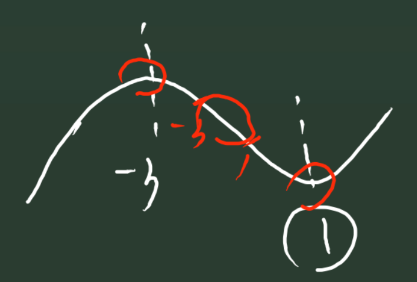

<h1 align="center">2021.2.1  笔记</h1>

#### 导数判断函数单调性

① 如果在$(a,b)$内，$f'(x) \ge 0$，$f'(x)$不恒为$0$，则$f(x)$在此区间是增函数，$(a,b)$是$f(x)$的单调增区间。

② 如果在$(a,b)$内，$f'(x)\le 0$，$f'(x)$不恒为$0$，则$f(x)$在此区间是减函数，$(a,b)$是$f(x)$的单调减区间。

#### 求函数单调区间

① 写出定义域

② 求导

③ 令$f'(x)>0$(或者$<0$)

④ 多个区间用“和”连接，不可使用“或”或“$\cup$”

**注**：单调区间可开可闭

##### 区别：“单调减区间是(a,b)”和“在(a,b)单调递减”

“单调减区间是$(a,b)$” 代表$f'(a)=f'(b)=0$

#### 导数与函数的凹凸性

① $f'(x)$增，则$f(x)$上凸。

① $f'(x)$减，则$f(x)$下凹。

**一阶导数正负决定原函数单调性**

**二阶导数正负决定函数凹凸性**

##### 注：函数凹凸性的定义

① 若$\forall x_1,x_2 \in (a,b) ,\; f(\frac{x_1+x_2}{2})>\frac{f(x_1)+f(x_2)}{2}$，则$f(x)$在区间$(a,b)$是凸函数。

② 若$\forall x_1,x_2 \in (a,b) ,\; f(\frac{x_1+x_2}{2})<\frac{f(x_1)+f(x_2)}{2}$，则$f(x)$在区间$(a,b)$是凹函数。

#### 导数与奇偶性

① 若$f(x)$是奇函数，则$f(-x)=-f(x)$，则$f'(x)=f'(-x)$

① 若$f(x)$是偶函数，则$f(-x)=f(x)$，则$f'(x)=-f'(-x)$

#### 已知单调性，求参数范围

$$题设形式  \begin{cases} ① f(x)在区间(a,b)单调递增 \\② f(x)在区间(a,b)存在单调增区间\end{cases}$$

##### 思路：在区间$(a,b)$
① $f'(x) \ge 0$，恒成立，且$f'(x)$不恒等于0。

若解出的参数**检验**时使导数恒为$0$，舍去。

② $f'(x) > 0 $ 有解

#### 例题1：

若函数$f(x)=ax^3+3x^2-x+z$在$R$上是减函数，求$a$范围。

##### 解：

$f'(x)=3ax^2+6x-1$

$a\neq 0$时，

$$\begin{cases}a<0 \\ \Delta \le 0\end{cases}$$

解得

$a \in (-∞,-3]$

#### 例题2：

已知函数$f(x)=\ln x,g(x)=\frac{1}{2}ax^2+2x(a\neq 0)$

(1)若函数$h(x)=f(x)-g(x)$存在单调递减区间，求$a$取值范围。

(2)若函数$h(x)=f(x)-g(x)$在$[1,4]$上单调递减，求$a$取值范围。

(3)若函数$h(x)=f(x)-g(x)$在$[1,4]$上单调递增，求$a$取值范围。

(4)若函数$h(x)=f(x)-g(x)$在$[1,4]$上存在单调减区间，求$a$取值范围。

##### 解：

(1) 

$h(x)=\ln x-\frac{1}{2}ax^2-2x$

$h(x)$定义域为$x\in (0,＋∞)$

$h'(x)=\frac{1}{x}-ax-2$

由题意得，$h'(x)<0$ 有解

$a>(\frac{1}{x^2}+\frac{2}{x})_{min}=-1$

$\therefore a \in (-1,1)\cup(1,+\infty)$

(2)

由题意得，$h'(x)<0$ 在$[1,4]$恒成立

$a\ge(\frac{1}{x^2}+\frac{2}{x})_{max}=-\frac{7}{16}$

$\therefore a \in (-\frac{7}{16},1)\cup(1,+\infty)$

(3)

由题意得，$h'(x)>0$ 在$[1,4]$恒成立

$a\le(\frac{1}{x^2}+\frac{2}{x})_{min}=-1$

$\therefore a \in (-\infty,-1)$

(4)

由题意得，$h'(x)<0$ 在$[1,4]$有解

$a>(\frac{1}{x^2}+\frac{2}{x})_{min}=-1$

$\therefore a \in (-1,1)\cup(1,+\infty)$

#### 例题3：

设直线 $l_1,l_2$分别是函数$f(x)=\begin{cases}-\ln x,0<x<1 \\ \ln x,x>1\end{cases}$图像上点$P_1,P_2$处的切线，$l_1$与$l_2$垂直相交于点$P$，且$l_1,l_2$分别与$y$轴相交于点$A,B$,则$\triangle PAB$的面积的取值范围是

##### 解：

设$P_1(x_1,-\ln x_1),P_2(x_2,\ln x_2)$

$\because f'(x)=\begin{cases}-\frac{1}{x},0<x<1\\ \frac{1}{x},x>1\end{cases} $

$\therefore$设$l_{AP_1}:y+\ln x_1=-\frac{1}{x_1}(x-x_1)$，$l_{BP_1}:y-\ln x_2=\frac{1}{x_2}(x-x_2)$

令$x=0$，可求得$y_A=1-\ln x_1$，$y_B=-1+\ln x_2$

$\therefore |y_A-y_B|=2-\ln x_1x_2$

$\because k_1 \cdot k_2=-1$

$\therefore -\frac{1}{x_1x_2}=-1$

$\therefore |y_A-y_B|=2$

联立

$$\begin{cases} l_1\\l_2\end{cases} \Longrightarrow x_p=\frac{2-\ln x_1x_2}{\frac{1}{x_1}+\frac{1}{x_2}}=\frac{2}{x_1+x_2}$$

$\begin{aligned}\therefore S_{\triangle PAB}&=\frac{1}{2}|y_A-y_B|\cdot |x_P|  \\  &=\frac{1}{2}\cdot 2\cdot \frac{2}{x_1+x_2} \\ &=\frac{2}{x_1+x_2}\end{aligned}$

$\because x_1+x_2 \ge 2\sqrt{x_1x_2}=2$，当且仅当$x_1=x_2=1$时等号成立。

$\because x_1 \in (0,1)，x_2\in (1,+∞)$

$\therefore x_1+x_2 >2$ 

$\therefore \frac{2}{x_1+x_2} < 1$

$\therefore S_{\triangle PAB} \in (0,1)$