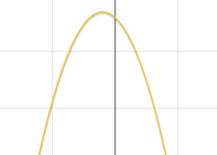

<h1 style="align">2021.2.10 笔记</h1>

### 专题：讨论含参函数的单调性

#### 例题1

已知函数$f(x)=\ln x-\frac 1 2 ax^2,a\in \R$

求函数$f(x)$的单调区间

##### 解：

定义域$(0,+\infty)$

$g(x)=\frac {1}{x}-ax=\frac{1-ax^2}{x}$

> 本题采取通分，不通分见例题6

① $a\le 0$

$f'(x)>0$

$\therefore f(x)$在$(0,+\infty)$单调递增

② $a>0$ 

当$f'(x)=0$时，$x=\sqrt \frac 1 a$

当$x$变化时，$f'(x),f(x)$变化如下表

|$x$|$(0,\sqrt \frac 1 a)$|$\sqrt \frac 1 a$|$(\sqrt \frac 1 a,+\infty)$|
|:-:|:-:|:-:|:-:|
|$f'(x)$|$-$|$0$|$+$|
|$f(x)$|$↘$||$↗$|

$\therefore f(x)$在$(0,\sqrt \frac 1 a)$单调递减，在$(\sqrt \frac 1 a,+\infty)$单调递增

综上所述

① 当$a\le 0$时，$f(x)$在$(0,+\infty)$单调递增

② 当$a>0$时，$f(x)$在$(0,\sqrt \frac 1 a)$单调递减，在$(\sqrt \frac 1 a,+\infty)$单调递增

#### 求含参函数单调性步骤

$$\begin{cases}①导数为2项式：\begin{cases}a\le c\\a >c\end{cases}，c为某一常数\\②导数为3项式：\begin{cases}① 可因式分解
：\begin{cases}开口\\根大小\end{cases}\\② 不可因式分解\begin{cases}①开口\\②f'(0)\\③对称轴\\④\Delta\\⑤区间端点\end{cases}\end{cases}\end{cases}$$

#### 例题2

已知函数$f(x)=e^x,g(x)=-\frac a 2 x^2-x,$，(其中$a\in \R,e$为自然对数的底数)

令$h(x)=f'(x)$，求$h(x)$的单调区间

##### 解：

$h(x)=e^x-ax-1$

$h'(x)=e^x-a$

① $a\le 0$时

$f'(x)>0$

$\therefore f(x)$在$\R$上为增函数

② $a>0$时

当$h'(x)=0$时，$x=\ln a$

当$x$变化时，$f'(x),f(x)$变化如下表

|$x$|$(-\infty,\ln a)$|$\ln a$|$(\ln a,+\infty)$|
|:-:|:-:|:-:|:-:|
|$f'(x)$|$-$|$0$|$+$|
|$f(x)$|$↘$||$↗$|

$\therefore f(x)$在$(-\infty,\ln a)$单调递减，在$(\ln a,+\infty)$单调递增

综上所述：

① 当$a\le 0$时,，$f(x)$在$R$单调递增

② 当$a > 0$时，$f(x)$在$(-\infty,\ln a)$单调递减，在$(\ln a,+\infty)$单调递增

#### 例题3

已知函数$f(x)=a\ln x+\frac{1-x}{1+x}$，其中实数$a$为常数且$a>0$

求函数$f(x)$的单调区间

##### 解：

定义域$(0,+\infty)$

$f'(x)=\frac{ax^2+x(2a-2)+a}{x(x+1)^2}$

令$g(x)=ax^2+x(2a-2)+a$

$g(x)$的对称轴为$x=-1+\frac 1 a$

$g(0)=a>0$

① $g(x)$对称轴小于等于$0$,即$a\in[1,+\infty)$时

当$x\in(0,+\infty)$时，$g(x)>a>0$

$\therefore f(x)$在$(0,+\infty)$单调递增

② $g(x)$对称轴大于$0$，即$a\in(0,1)$时

<1> 当$\Delta \le 0$，即$a\in[\frac 1 2,1)$时

$g(x)>0$

$\therefore f(x)$在$(0,+\infty)$单调递增

<2> 当$\Delta > 0$，即$a\in(0,\frac 1 2)$时

令$g(x)=0$，解得方程的根为

$x= \frac{1-a\pm\sqrt{1-2a}}{a}$

当$x$变化时，$f'(x),f(x)$变化如下表

|$x$|$(0,\frac{1-a-\sqrt{1-2a}}{a})$|$\frac{1-a-\sqrt{1-2a}}{a}$|$(\frac{1-a-\sqrt{1-2a}}{a},\frac{1-a+\sqrt{1-2a}}{a})$|$\frac{1-a+\sqrt{1-2a}}{a}$|$(\frac{1-a+\sqrt{1-2a}}{a},+\infty)$|
|:-:|:-:|:-:|:-:|:-:|:-:|
|$f'(x)$|$+$|$0$|$-$|$0$|$+$|
|$f(x)$|$↗$||$↘$||$↗$|

$\therefore f(x)$在$(0,\frac{1-a-\sqrt{1-2a}}{a})$和$(\frac{1-a+\sqrt{1-2a}}{a},+\infty)$单调递增，在$(\frac{1-a-\sqrt{1-2a}}{a},\frac{1-a+\sqrt{1-2a}}{a})$单调递减

综上所述：

① 当$a\in[\frac 1 2,+\infty)$时，$f(x)$在$(0,+\infty)$单调递增

② 当$a\in(0,\frac 1 2)$时，$f(x)$在$(0,\frac{1-a-\sqrt{1-2a}}{a})$和$(\frac{1-a+\sqrt{1-2a}}{a},+\infty)$单调递增，在$(\frac{1-a-\sqrt{1-2a}}{a},\frac{1-a+\sqrt{1-2a}}{a})$单调递减

#### 例题4

已知函数$f(x)=ae^{2x}+(a-2)e^x-x$，求$f(x)$的单调性

##### 解：

$f'(x)=2ae^{2x}+(a-2)e^x-1=(2e^x+1)(ae^x-1)$

① 当$a\le 0$时

$f'(x)<0$

$\therefore f(x)$在$\R$单调递减

② 当$a>0$时

令$f'(x)=0$，此时$x=-\ln a$

当$x$变化时，$f'(x),f(x)$变化如下表

|$x$|$(-\infty,-\ln a)$|$-\ln a$|$(-\ln a,+\infty)$|
|:-:|:-:|:-:|:-:|
|$f'(x)$|$-$|$0$|$+$|
|$f(x)$|$↘$||$↗$|

$\therefore f(x)$在$(-\infty,-\ln a)$单调递减，在$(-\ln a,+\infty)$单调递增

综上所述:

① 当$a\le 0$时，$f(x)$在$\R$单调递减

② 当$a>0$时，$f(x)$在$(-\infty,-\ln a)$单调递减，在$(-\ln a,+\infty)$单调递增

#### 例题5

已知函数$f(x)=e^{2x}-(2a-1)e^x-(a+1)x.a\in\R$，求$f(x)$的单调性

##### 解：

$f'(x)=2e^{2x}-(2a+1)e^x-(a+1)=(2e^x+1)[e^x-(a+1)]$

① 当$a\in(-\infty,-1]$时

$f'(x)>0$

$\therefore f(x)$在$\R$单调递增

② 当$a\in(-1,+\infty)$时

令$f'(x)=0$，此时$x=\ln(a+1)$

当$x$变化时，$f'(x),f(x)$变化如下表

|$x$|$(-\infty,\ln (a+1))$|$\ln (a+1)$|$(\ln (a+1),+\infty)$|
|:-:|:-:|:-:|:-:|
|$f'(x)$|$-$|$0$|$+$|
|$f(x)$|$↘$||$↗$|

$\therefore f(x)$在$(-\infty,\ln (a+1))$单调递减，在$(\ln (a+1),+\infty)$单调递增

综上所述:

① 当$a\in (-\infty,-1]$时，$f(x)$在$\R$单调递增

② 当$a\in(-a,+\infty)$时，$f(x)$在$(-\infty,\ln (a+1))$单调递减，在$(\ln (a+1),+\infty)$单调递增

#### 例题6

设函数$f(x)=\ln x-2mx^2-n(m,n\in \R)$，求$f(x)$单调性

##### 解：

定义域$(0,+\infty)$

$f'(x)=\frac 1 x-4mx$

> 本题不采取通分

$\because x>0$

$\therefore$当$m<0$时，$f'(x)>0$,$f(x)$在$(0,+\infty)$单调递增

当$m>0$时，令$f'(x)=0$，此时$x=\sqrt \frac {1}{4m}$

当$x$变化时，$f'(x),f(x)$变化如下表

|$x$|$(0,\sqrt \frac 1 {4m})$|$\sqrt \frac 1 {4m}$|$(\sqrt \frac 1 {4m},+\infty)$|
|:-:|:-:|:-:|:-:|
|$f'(x)$|$-$|$0$|$+$|
|$f(x)$|$↘$||$↗$|

$\therefore f(x)$在$(0,\sqrt \frac 1 {4m})$单调递减，在$(\sqrt \frac 1 {4m},+\infty)$单调递增

综上所述:

① 当$m<0$时，$f(x)$在$(0,+\infty)$单调递增

② 当$m>0$时，$f(x)$在$(0,\sqrt \frac 1 {4m})$单调递减，在$(\sqrt \frac 1 {4m},+\infty)$单调递增

#### 例题7

已知函数$f(x)=e^x-ax+a$，其中$a\in\R$($e$为自然对数的底数)，讨论$f(x)$的单调性

##### 解：

$f'(x)=e^x-a$

① 当$a\le 0$时

$f'(x)>0$

$\therefore f(x)$在$\R$单调递增

② 当$a>0$时

令$f'(x)=0$，此时$x=\ln a$

当$x$变化时，$f'(x),f(x)$变化如下表

|$x$|$(-\infty,\ln a)$|$\ln a$|$(\ln a,+\infty)$|
|:-:|:-:|:-:|:-:|
|$f'(x)$|$-$|$0$|$+$|
|$f(x)$|$↘$||$↗$|

$\therefore f(x)$在$(-\infty,\ln a)$单调递减，在$(\ln a,+\infty)$单调递增

综上所述:

① 当$a\le 0$时，$f(x)$在$\R$单调递增

② 当$a > 0$时，$f(x)$在$(-\infty,\ln a)$单调递减，在$(\ln a,+\infty)$单调递增

#### 例题8

已知函数$f(x)=\ln x-ax$，其中$e$为自然对数的底数，讨论$f(x)$在区间$[1,e]$的单调性

##### 解：

$f'(x)=\frac 1 x-a$

① 当$a\le 0$时

$f'(x)>0$

$\therefore f(x)$在$[1,e]$单调递增

② 当$a>0$时

令$f'(x)=0$，此时$x=\frac 1 a$

当$f(x)$的定义域为$(0,+\infty)$，$x$变化时，$f'(x),f(x)$变化如下表

|$x$|$(0,\frac 1 a)$|$\frac 1 a$|$(\frac 1 a,+\infty)$|
|:-:|:-:|:-:|:-:|
|$f'(x)$|$+$|$0$|$-$|
|$f(x)$|$↗$||$↘$|

$\therefore f(x)$在$(0,\frac 1 a)$单调递增，在$(\frac 1 a,+\infty)$单调递减

<1> 当$\frac 1 a<1$，即$a\in (1,+\infty)$时，$f(x)$在$[1,e]$单调递减

<2> 当$\frac 1 a>e$，即$a\in(0,\frac 1 e)$时，$f(x)$在$[1,e]$单调递增

<3> 当$\frac 1 a \in [1,e]$，即$a\in [\frac 1 e,1]$时，$f(x)$在$[1,\frac 1 a]$单调递增，在$[\frac 1 a,e]$单调递减

综上所述

① 当$a\in(-\infty,\frac 1 e)$，$f(x)$在$[1,e]$单调递增

② 当$a[\frac 1 e,1]$时，$f(x)$在$[1,\frac 1 a]$单调递增，在$[\frac 1 a,e]$单调递减

③ 当$\frac 1 a<1$，即$a\in (1,+\infty)$时，$f(x)$在$[1,e]$单调递减

#### 例题9

设函数$f(x)=a\ln x+b(x-1),(x>0,ab\neq 0)$
(1)讨论函数$f(x)$单调性
(2)若$b=-2a$，求函数$f(x)$的最值

##### 解：

(1)

$f'(x)=\frac a x+b=\frac {a+bx} x$

① 当$b>0,a>0$时，$f'(x)$在$(0,+\infty)$恒为负，$f(x)$在$(0,+\infty)$单调递增

② 当$b<0,a<0$时，$f'(x)$在$(0,+\infty)$恒为正，$f(x)$在$(0,+\infty)$单调递减

③ 当$b>0,a<0$时

令$f'(x)=0$，则$x=-\frac a b$

当$x$变化时，$f'(x),f(x)$变化如下表

|$x$|$(0,-\frac a b)$|$-\frac a b$|$(-\frac a b,+\infty)$|
|:-:|:-:|:-:|:-:|
|$f'(x)$|$-$|$0$|$+$|
|$f(x)$|$↘$||$↗$|

$\therefore f(x)$在$(0，-\frac a b)$单调递减，在$(-\frac a b,+\infty)$单调递增

④ 当$b<0,a>0$时，同理③，可得

$f(x)$在$(0，-\frac a b)$单调递增，在$(-\frac a b,+\infty)$单调递减

综上所述

① 当$b>0,a>0$时，$f(x)$在$(0,+\infty)$单调递增

② 当$b<0,a<0$时，$f(x)$在$(0,+\infty)$单调递减

③ 当$b>0,a<0$时，$f(x)$在$(0，-\frac a b)$单调递减，在$(-\frac a b,+\infty)$单调递增

④ 当$b<0,a>0$时，$f(x)$在$(0，-\frac a b)$单调递增，在$(-\frac a b,+\infty)$单调递减

(2)

此时，$f(x)=a\ln x-2ax+2a$

$f'(x)=\frac a x-2a$

令$f'(x)=0$，此时$x=\frac 1 2$

① 当$a>0$时，$b<0$

由(1)得，$f(x)$在$(0，\frac 1 2)$单调递增，在$(\frac 1 2,+\infty)$单调递减

$\therefore f(x)$在$x=\frac 1 2$处取得最大值，最大值为$-a\ln 2+a$

② 当$a<0$时，$b>0$

由(1)得，$f(x)$在$(0，\frac 1 2)$单调递减，在$(\frac 1 2,+\infty)$单调递增

$\therefore f(x)$在$x=\frac 1 2$处取得最小值，最小值为$-a\ln 2+a$

综上所述：

① 当$a>0$时，$f(x)$有最大值为$-a\ln 2+a$

① 当$a<0$时，$f(x)$有最小值为$-a\ln 2+a$

#### 例题10

已知函数$f(x)=\ln(x+1)-\frac{ax}{x+1}-x,a\in \R$，当$a>0$时，求函数$f(x)$的单调区间

##### 解：

$f'(x)=\frac 1 {x+1} - \frac {a}{(x+1)^2}=-\frac{x^2+x+a}{(x+1)^2}$

> 分子不可因式分解
> 开口：向下
> 与y轴交于：负半轴
> 对称轴恒为$-\frac 1 2$
> 大致函数图像如下
> 

对于方程：

$-x^2-x-a=0$

① 当$\Delta \le 0$，即$a\ge \frac 1 4$时

$f'(x)\le 0$

$\therefore f(x)$在$\R$单调递减

② 当$\Delta > 0$，即$a<\frac 1 4$时

$\because f(0)<0$，对称轴为$x=-\frac 1 2$

设方程的解为$x_1,x_2$，不妨设$-1<x_1<x_2<0$

当$x$变化时，$f'(x),f(x)$变化如下表

|$x$|$(-\infty,x_1)$|$x_1$|$(x_1,x_2)$|$x_2$|$(x_2,+\infty)$|
|:-:|:-:|:-:|:-:|:-:|:-:|
|$f'(x)$|$-$|$0$|$+$|$0$|$-$|
|$f(x)$|$↘$||$↗$||$↘$|

$\therefore f(x)$在$(-\infty,x_1)$和$(x_2,+\infty)$单调递减，在$(x_1,x_2)$单调递增

求根公式得

$x_1=-\frac {1+\sqrt{1-4a}}{2},x_2=-\frac {1-\sqrt{1-4a}}{2}$

带入得

$f(x)$在$(-\infty,-\frac {1+\sqrt{1-4a}}{2})$和$(-\frac {1-\sqrt{1-4a}}{2},+\infty)$单调递减，在$(-\frac {1+\sqrt{1-4a}}{2},-\frac {1-\sqrt{1-4a}}{2})$单调递增

综上所述：

① 当$a\ge \frac 1 4$时，$f(x)$在$\R$单调递减

② 当$a < \frac 1 4$时，$f(x)$在$(-\infty,-\frac {1+\sqrt{1-4a}}{2})$和$(-\frac {1-\sqrt{1-4a}}{2},+\infty)$单调递减，在$(-\frac {1+\sqrt{1-4a}}{2},-\frac {1-\sqrt{1-4a}}{2})$单调递增

#### 例题11

已知常数$a>0$，函数$f(x)=\ln (1+ax)-\frac {2x} {x+2}$，讨论$f(x)$在$(0,+\infty)$的单调性

##### 解：

$f'(x)=\frac{a}{1+ax}-\frac{4}{(x+2)^2}=\frac{ax^2+4a-4}{(ax+1)(x+2)^2}$

$\because a>0$

① 当$f(0)\ge 0$，即$a \ge 1$时

$f'(x)$在$(0,+\infty)$大于等于$0$

$\therefore f(x)$在$(0,+\infty)$单调递增

② 当$f(0)<0$，即$a\in(0,1)$时

令$f'(x)=0$，此时$x=\sqrt\frac{4-4a}{a}$

当$x$变化时，$f'(x),f(x)$变化如下表

|$x$|$(0,\sqrt\frac{4-4a}{a})$|$\sqrt\frac{4-4a}{a}$|$(\sqrt\frac{4-4a}{a},+\infty)$|
|:-:|:-:|:-:|:-:|
|$f'(x)$|$-$|$0$|$+$|
|$f(x)$|$↘$||$↗$|

$\therefore f(x)$在$(0，\sqrt\frac{4-4a}{a})$单调递减，在$(\sqrt\frac{4-4a}{a},+\infty)$单调递增

综上所述

① 当$a\in [1,+\infty)$时，$ f(x)$在$(0,+\infty)$单调递增

② 当$a\in(0,1)$时，$f(x)$在$(0，\sqrt\frac{4-4a}{a})$单调递减，在$(\sqrt\frac{4-4a}{a},+\infty)$单调递增

#### 例题12

已知函数$f(x)=e^x(e^x-a)-ax^2$，讨论$f(x)$的单调性

##### 解：

$f'(x)=e^x(e^x-a)+e^{2x}-a^2=2e^{2x}-ae^x-a^2=(2e^x+a)(e^x-a)$

① 当$a=0$时

$f'(x)>0$

$\therefore f(x)$在$\R$单调递增

② 当$a>0$时

令$f'(x)=0$，此时$x=\ln a$

当$x$变化时，$f'(x),f(x)$变化如下表

|$x$|$(-\infty,\ln a)$|$\ln a$|$(\ln a,+\infty)$|
|:-:|:-:|:-:|:-:|
|$f'(x)$|$-$|$0$|$+$|
|$f(x)$|$↘$||$↗$|

$\therefore f(x)$在$(-\infty,\ln a)$单调递减，在$(\ln a,+\infty)$单调递增

③ 当$a<0$时

令$f'(x)=0$，此时$x=\ln(-\frac a 2)$

当$x$变化时，$f'(x),f(x)$变化如下表

|$x$|$(-\infty,-\frac a 2)$|$-\frac a 2$|$(-\frac a 2,+\infty)$|
|:-:|:-:|:-:|:-:|
|$f'(x)$|$-$|$0$|$+$|
|$f(x)$|$↘$||$↗$|

$\therefore f(x)$在$(-\infty,-\frac a 2)$单调递减，在$(-\frac a 2,+\infty)$单调递增

综上所述：

① 当$a=0$时，$f(x)$在$\R$单调递增

② 当$a>0$时，$f(x)$在$(-\infty,\ln a)$单调递减，在$(\ln a,+\infty)$单调递增

③ 当$a<0$时，$f(x)$在$(-\infty,-\frac a 2)$单调递减，在$(-\frac a 2,+\infty)$单调递增

#### 例题13

已知函数$f(x)=\frac 1 2 x^2-ax+(a-1)\ln x$，求函数$f(x)$的单调区间

##### 解：

定义域$(0,+\infty)$

$f'(x)=x-a+\frac{a-1}{x}=\frac{x^2-ax+a-1}{x}=\frac{[x-(a-1)](x-1)}{x}$

令$f'(x)=0$，此时$x_1=1,x_2=a-1$

① 当$a=2$时，$f(x)\ge 0$

$f(x)$在$(0,+\infty)$单调递增

② 当$a-1>1$，即$a>2$时，

在区间$(0,1)$和区间$(a-1,+\infty)$上，$f'(x)>0$

在区间$(1,a-1)$上$f'(x)<0$

$\therefore f(x)$的单调增区间为$(0,1)$和$(a-1,+\infty)$，单调减区间为$(1,a-1)$

③ 当$a-1\in(0,1)$，即$a\in (1,2)$时

在区间$(0,a-1)$和区间$(1,+\infty)$上，$f'(x)>0$

在区间$(a-1,1)$上，$f'(x)<0$

$\therefore f(x)$的单调增区间为$(0,a-1)$和$(1,+\infty)$，单调减区间为$(a-1,1)$

④ 当$a-1\le 0$，即$a\le 1$时

在区间$(0,1)$上，$f'(x)<0$

在区间$(1,+\infty)$上，$f'(x)>0$

$\therefore f(x)$的单调增区间是$(1,+\infty)$，单调减区间是$(0,1)$

综上所述：

① 当$a=2$时，$f(x)$在$(0,+\infty)$单调递增

② 当$a>2$时，$f(x)$的单调增区间为$(0,1)$和$(a-1,+\infty)$，单调减区间为$(1,a-1)$

③ 当$a\in(1,2)$时，$f(x)$的单调增区间为$(0,a-1)$和$(1,+\infty)$，单调减区间为$(a-1,1)$

④ 当$a\le 1$时，$f(x)$的单调增区间是$(1,+\infty)$，单调减区间是$(0,1)$

#### 例题14

已知函数$f(x)=\ln (e^x+1)-ax(a>0)$，讨论函数$y=f(x)$的单调区间

##### 解：

$f'(x)=\frac{e^x}{e^x+1}-a$

> 可以采取通分，然后讨论正负
> 这里不采取通分，根据$\frac{e^x}{e^x+1}$式的特点，采用分离常数

$f'(x)=1-a-\frac{1}{e^x+1}$

> 项$-\frac{1}{e^x+1}$恒为负

① 当$1-a\le 0$，即$a\ge 1$时

$f'(x)<0$

$\therefore f(x)$在$(0,+\infty)$单调递减

② 当$1-a>0$，即$a\in (0,1)$时

令$f'(x)=0$，此时$x=\ln \frac {a}{1-a}$

$f'(x)$在$(-\infty,\ln\frac a {1-a})$恒为负，在$(\ln\frac a {1-a},+\infty)$恒为正

$\therefore f(x)$在$(-\infty,\ln\frac a {1-a})$单调递减，在$(\ln\frac a {1-a},+\infty)$单调递增

综上所述：

① 当$a\ge 1$时，$f(x)$在$(0,+\infty)$单调递增

② 当$a\in (0,1)$时，$f(x)$在$(-\infty,\ln \frac a {1-a})$单调递减，在$(\ln\frac a {1-a},+\infty)$单调递增

#### 例题15

已知函数$f(x)=e^x(ax^2-2x+2),(a>0)$，试讨论$f(x)$的单调性

##### 解：

$f'(x)=e^xx(ax+2a-2)=ae^xx[x-(\frac 2 a-2)]$

令$f'(x)=0$，此时$x=0$或$x=\frac 2 a -2$

① 当$\frac 2 a-2=0$，即$a=1$时

$f'(x)\ge 0$

$\therefore f(x)$在$\R$单调递增

② 当$\frac 2 a-2<0$，即$a>1$时

$f'(x)$在$(-\infty,\frac 2 a -2)$和$(0,+\infty)$为正，在$(\frac 2 a-2,0)$为负

$\therefore f(x)$在$(-\infty,\frac 2 a -2)$和$(0,+\infty)$单调递增，在$(\frac 2 a-2,0)$单调递减

③ 当$\frac 2 a - 2>0$，即$a\in (0,1)$时

$f'(x)$在$(-\infty,0)$和$(\frac 2 a-2)$为正，在$(0,\frac 2 a-2)$为负

$\therefore f(x)$在$(-\infty,0)$和$(\frac 2 a-2)$单调递增，在$(0,\frac 2 a-2)$单调递减

综上所述：

① 当$a=1$时，$f(x)$在$\R$单调递增

② 当$a>1$时，$ f(x)$在$(-\infty,\frac 2 a -2)$和$(0,+\infty)$单调递增，在$(\frac 2 a-2,0)$单调递减

③ 当$a\in (0,1)$时，$f(x)$在$(-\infty,0)$和$(\frac 2 a-2)$单调递增，在$(0,\frac 2 a-2)$单调递减