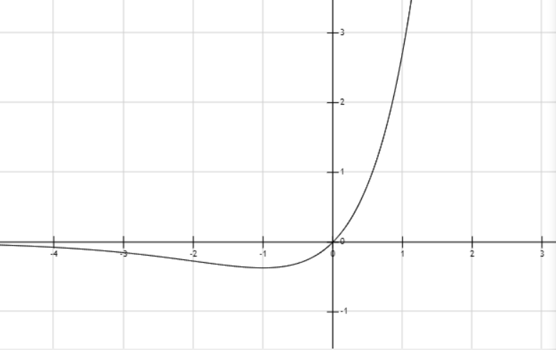
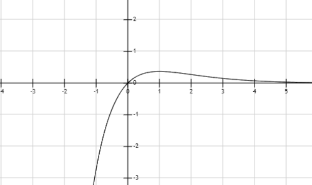
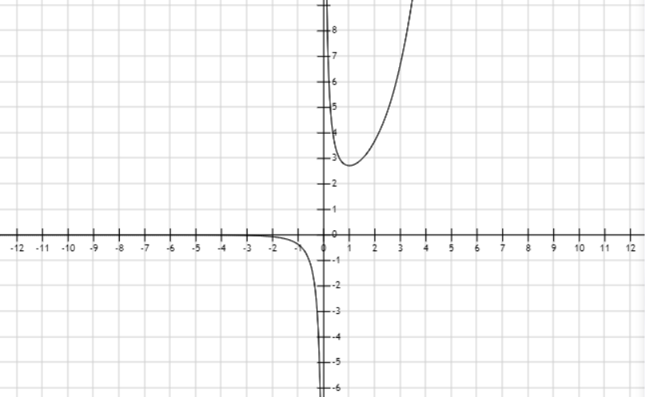
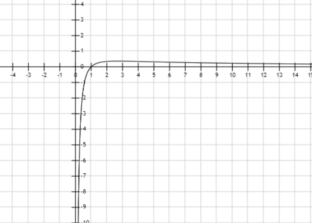
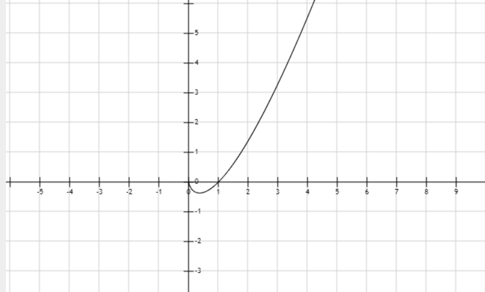
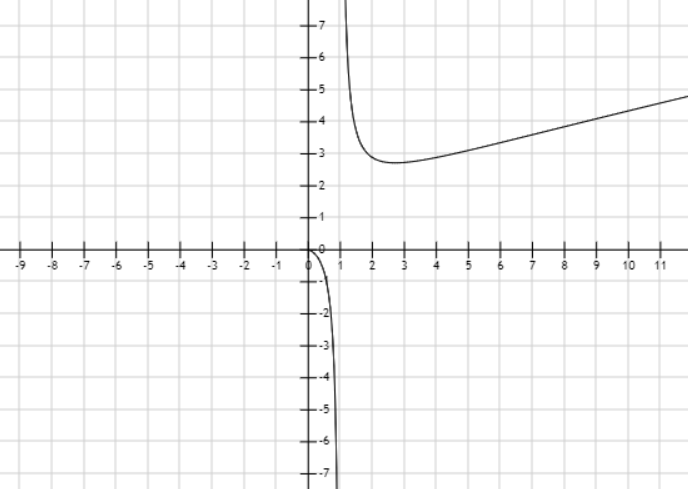
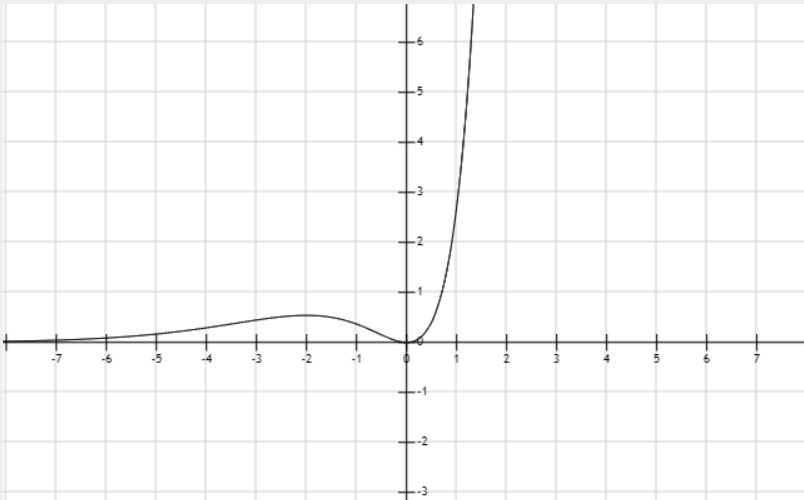

<h1 align="center">2020.2.3 笔记</h1>

##### 求解三次方程

$\begin{cases}y=4x-4\\y=\frac{1}{3}x^3+\frac{4}{3}\end{cases} \Longrightarrow x^3-12x+16=0$

##### 方法：

① 试根法：

    根据已知解，可以判断方程必存的因式，如上式的(x-2)。
    然后使用多项式除法

② 多项式除法

    辗转相除，每次消最高次

##### 七种特殊函数图像

① $f(x)=xe^x$

>$f(x)$在$(-\infty,-1)$单调递减
>$\;\;\;\;\;\;\;$在$(-1,+\infty)$单调递增
>$\;\;\;\;\;\;\;$在$=-1$处取得最小值

② $f(x)=\frac{x}{e^x}$

>$f(x)$在$(-\infty,1)$单调递增
>$\;\;\;\;\;\;\;$在$(1,+\infty)$单调递增
>$\;\;\;\;\;\;\;$在$=1$处取得最大值

③ $f(x)=\frac{e^x}{x}$

>$f(x)$在$(-\infty,0)$单调递减
>$\;\;\;\;\;\;\;$在$(0,1)$单调递减
>$\;\;\;\;\;\;\;$在$(1,+\infty)$单调递增

④ $f(x)=\frac{\ln x}{x}$

>$f(x)$在$(0,e)$单调递增
>$\;\;\;\;\;\;\;$在$(e,+\infty)$单调递减
>$\;\;\;\;\;\;\;$在$x=e$处取得最大值

⑤ $f(x) = x\ln x$

>$f(x)$在$(0,\frac{1}{e})$单调递减
>$\;\;\;\;\;\;\;$在$(\frac{1}{e},+\infty)$单调递增
>$\;\;\;\;\;\;\;$在$x=\frac{1}{e}$处取得最小值

⑥ $f(x)=\frac{x}{\ln x}$

>$f(x)$在$(0,1)$单调递减
>$\;\;\;\;\;\;\;$在$(1,e)$单调递减
>$\;\;\;\;\;\;\;$在$(e,+\infty)$单调递增

⑦ $f(x)=x^2e^x$

>$f(x)$在$(-\infty,-2)$单调递增
>$\;\;\;\;\;\;\;$在$(-2,0)$单调递减
>$\;\;\;\;\;\;\;$在$(0,+\infty)$单调递增

##### 结论1：

对于函数来说，如果没有外加限制，函数本身没有定义，一般为正负趋近同时趋近于正负无穷时，该点没有定义。

#### 两种特殊不等式

①$e^x \ge x+1$，当且仅当$x=0$时，等号成立

②$\ln x \le x-1$，当且仅当$x=$时，等号成立

### 三次函数

#### 定义：

形如$f(x)=ax^3+bx^2+cx+d$的函数称为三次函数

#### 三次函数的图像：

##### 推导：

$f'(x)=3ax^2+2bx+c$

① $a>0$时

1.$\Delta \le 0,f'(x)\ge 0,f(x)↑$

2.$\Delta > 0$,$f(x)↑↓↑$，极值点为$f'(x)$的解。

② $a<0$时

1.$\Delta \le 0,f'(x)\le 0,f(x)↓$

2.$\Delta > 0$,$f(x)↓↑↓$，极值点为$f'(x)$的解。

#### 对称性：

以函数上横坐标为$-\frac{b}{3a}$的点为中心，中心对称

##### 推导①：

根据两极值点连线的中点为中心对称点可得

$x_{center}=\frac{x_1+x_2}{2}$

解得

$x_{center}=-\frac{b}{3a}$

##### 推导②：

中心点处，函数的二阶导数$f''(x)=0$，解得$x_{center}=-\frac{b}{3a}$

#### 例题1：

若函数$f(x)=ax^3-bx+4$，当$x=2$时，函数$f(x)$取得极值$-\frac{4}{3}$

(1) 求方程$f(x)$的解析式

(2) 若方程$f(x)=k$有$3$个不同的实数根，求实数$k$的取值范围。

##### 解：

(1) 

$f'(x)=3ax^2-b$

由当$x=2$时，函数$f(x)$取得极值$-\frac{4}{3}$可知：

$$\begin{cases}f(2)=-\frac{4}{3}\\f'(2)=0\end{cases}\Longrightarrow \begin{cases}a=\frac{1}{3}\\b=4\end{cases}$$

$\therefore f(x)=\frac{1}{3}x^3-4x+4$

(2)

$\because f(x)$的对称中心为$(0,4)$

$\therefore$极大值点和极小值点分别为$-2,2$

$\because f(x)=k$有三不等实数根

$\therefore k \in (f(2),f(-2))$

代入解得

$k \in (-\frac{4}{3},\frac{28}{3})$

#### 例题2：

已知函数$f(x)=2x^3-(6a+3)x^2+12ax+16a^2(a<0)$只有一个零点$x_0$，则实数$a$的取值范围为

##### 解：

$\begin{aligned}f'(x)&=6x^2-(12a+6)x+12a\\&=6(x-2a)(x-1)\end{aligned}$

$\therefore$当$a\neq \frac{1}{2}, f'(x)=0$的解为

$\because a<0$

又$\because f(x)$在$(0,+\infty)$没有零点

$\therefore \begin{cases}f(1)>0\\f(2a)>0\\a<0\end{cases}$

解得

$a\in (-\infty,-\frac{1}{2})$ 

#### 已知极值求参数范围

##### 思路：

① 分参

② 带参求导

#### 例题：

若函数$f(x)=\frac{x^3}{3}-\frac{a}{2}x^2+x+1$在区间$(\frac{1}{2},3)$上有极值点，求$a$的取值范围

##### 解：

$f'(x)=x^2-ax+1,x\in (\frac{1}{2},3)$

$a=x+\frac{1}{x},x\in (\frac{1}{2},3)$

$a\in [2,\frac{10}{3})$

#### 比较类如：$a^b$和$b^a(a>b>e)$

##### 思路：

通过构造函数比较

##### 过程：

将两者取$\ln$

则前者为$b\ln a$和$a\ln b$

两边再同除以$ab$

则前者为$\frac{\ln a}{a}$后者为$\frac{\ln b}{b}$

根据函数$f(x)=\frac{\ln x}{x}$:

在$(0,e)$单调递增

在$(e,+\infty)$单调递减

判断得

$b^a>a^b$

#### 例题：

已知 $n>m>1$，求证$(1+m)^n>(1+n)^m$

##### 解：

要证$(1+m)^n>(1+n)^m$，

只需证$n\ln (1+m) > m\ln (1+n)$

即$\frac{\ln (1+m)}{m}>\frac{\ln (1+n)}{n}$

设函数$g(x)=\frac{\ln(x+1)}{x},x\in (1,+\infty)$

$g'(x)=\frac{\frac{x}{x+1}-ln(x+1)}{x^2}$

设$\phi(x)=\frac{x}{x+1}-ln(x+1)$

$\phi ' (x)=-\frac{x}{(x+1)^2}$

当$x\in(1,+\infty)$，$\phi'(x)<0$

$\therefore \phi(x)$在$(1,+\infty)$单调递减

$\because \phi(1)=\frac{1}{2}-\ln 2<0$

$\therefore \phi(x)$在$(1,+\infty)$恒小于零

$\therefore g'(x)$在$(1,+\infty)$恒小于零

$\therefore g(x)$在$(1,+\infty)$单调递减

$\because n>m>1$

$\therefore \frac{\ln (1+m)}{m}>\frac{\ln (1+n)}{n}$

$\therefore (1+m)^n>(1+n)^m$

### 极限

#### 洛必达法则

若函数$f(x)$和$g(x)$满足下列条件：

$$\begin{aligned}&① \lim_{x\rightarrow a}f(x)=0 \;,\; \lim_{x\rightarrow a}g(x)=0(或者\lim_{x\rightarrow a}f(x)=\infty \;,\; \lim_{x\rightarrow a}g(x)=\infty) \\&②在a的去心邻域内，f(x),g(x)都可导，且g'(x)\neq 0\end{aligned}$$

则

$$\lim_{x \rightarrow a}\frac{f(x)}{g(x)}=\lim _{x\rightarrow a}\frac{f'(x)}{g'(x)}$$

