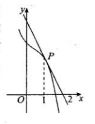
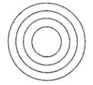

<h1 align="center">重点题目整理</h1>

#### 题型A：导数定义的变形

##### 题目1：

已知函数$f(x)$在$x_0$处的导数为$f'(x_0)$，则$\lim _{\Delta x\rightarrow 0}\frac{f(x_0)-f(x_0-m\Delta x)}{\Delta x}$等于

##### 解：

据导数定义可得，上式为$mf'(x_0)$

##### 题目2：

设$f(x)$是可导函数，且$\lim _{\Delta x\rightarrow 0}\frac{f(x_0-2\Delta x)-f(x_0)}{\Delta x}=2$，则$f'(x_0)=$

##### 解：

由导数定义得$-2f'(x_0)=2$

解得$f'(x_0)=-1$

#### 题型B：切线定义的三件事

##### 题目3：

如图，曲线$y=f(x)$在点$P(1,f(1))$处的切线$l$过点$(2,0)$，且$f'(1)=-2$，则$f(1)$的值为

##### 解：

设$l$为$y=kx+b$

由$f'(1)=-2$得，$k=-2$

由$l$过点$(2,0)$得，$y=2x+4$

$\therefore f(1）= 2$

##### 题目4：

已知函数$y=f(x)$的图像在$(2,f(2))$处的切线方程是$x-2y+1=0$，则$f(2)+f'(2)$的值是

##### 解：

由切线方程得$f(2)=\frac{3}{2}$，由方程对应的直线的斜率得$f'(2)=\frac{1}{2}$

$\therefore f(2)+f'(2)=2$

#### 题型C：导数应用

##### 题目5：

如图所示，水波的半径以$1m/s$的速度向外扩张，当半径为$5m$时，这水波面的圆面积的瞬时膨胀率是___$m^2/s$

##### 解：

设水波半径为$x$，水波面圆面积为$f(x)$，则

$f(x)=\pi x^2$

$\therefore f'(x)=2\pi x$

$\therefore f'(5)=10\pi$

$\therefore$当半径为$5m$时，这水波面的圆面积的瞬时膨胀率是$10\pi \; m^2/s$

#### 题型D：距离问题

##### 题目6：

已知两曲线$y=x^3+ax$和$y=x^2+bx+c$都经过点$P(1,2)$，且在点$P$处有公切线。
(1)求$a,b,c$的值
(2)求公切线所在的直线方程
(3)若抛物线$y=x^2+bx+c$上的点$M$到直线$y=4x-5$的距离最短，求点$M$的坐标和最短距离

##### 解：

(1)

由曲线$y=x^3+ax$经过点$P$得$a=1$

$\therefore0$公切线为$y=2x$

$\because y=x^2+bx+c$的导数为$y=2x+b$，且过点$P$

$\therefore \begin{cases}2=2+b\end{cases}$

##### 题目7：

点$P$是曲线$f(x)=x^2$上任意一点，则点$P$到直线$y=x-1$的最短距离是

##### 解：

$f'(x)=2x$

当$f'(x)=1$时，$x=\frac{1}{2}$

$\therefore$点$P$到直线$y=x-1$的最短距离即点$(\frac 1 2,\frac 1 4)$到直线$y=x-1$的最短距离

解得距离为$\frac {3\sqrt 2}{8}$

#### 题型E：求导法则的应用

##### 题目8：

已知函数$f(x)=x(x-1)(x-2)\cdot ... \cdot(x-100)$，则$f'(0)=$

##### 解：

题目所求为$f'(0)$，当带入$x=0$时，所有包含$x$因式的部分都为0，所以，我们可以得到

$f'(0)=100!$

#### 题型F：求导周期

##### 题目9：

设$f_0(x)=\sin x,f_1(x)=f'_0(x),f_2(x)=f'_1(x),...,f_{n+1}(x)=f_n'(x),n\in \N$，则$f_{2020}(x)=$

##### 解

如果记$a_n=f_n(x)$，则$a_n$是以$4$为周期的周期数列。

$\therefore f_{2020}(x)=f_0(x)=\sin x$

#### 题型G：两边同时求导

##### 题目10：

已知函数$f(x)$满足$f(x)=2xf'(e)+\ln x$，则$f'(e)=$

##### 解：

$f'(x)=2f'(e)+x^{-1}$

当$x=e$时

$f'(e)=2f'(e)+e^{-1}$

解得$f'(e)=-e^{-1}$

#### 题型H：构造函数比较大小

##### 题目11：

已知函数$f(x)=\frac {\ln x} x$

(1) 求函数$f(x)$的单调区间

(2) 已知$a,b\in \R,a>b>e$，求证$b^a>a^b$

##### 解：

(1)

$f(x)$定义域为$(1,+\infty)$

$f'(x)=\frac{1-\ln x}{x^2}$

当$f'(x)>0$时，$x<e$

$\therefore f(x)$在$(0,e)$单调递增，在$(e,+\infty)$单调递减

(2)

要证$b^a>a^b$，只需证$a\ln b>b\ln a$

即$\frac{\ln b}{b}>\frac{\ln a}{a}$

由(1)得，$f(x)$在$(e,+\infty)$单调递减

$\therefore \frac{\ln b}{b}>\frac{\ln a}{a}$

即$b^a>a^b$

#### 题型I：已知函数单调性求参数取值范围

##### 题目12：

已知$f(x)=\frac 1 3 x^3+mx^2+nx+1$的单调递减区间时$(-3,1)$，则$m+n$的值为

##### 解：

$f'(x)=x^2+2mx+n$

$\because$单调区间是$(-3,-1)$

$\therefore \begin{cases}f'(-3)=0\\f'(-1)=0\end{cases}\Longrightarrow \begin{cases}m=2\\n=3\end{cases}$

$\therefore m+n=5$

##### 题目13：

函数$f(x)=\sin 2x-4x-m\sin x$在$[0,2\pi]$单调递减，求$m$范围。

##### 解：

$f'(x)=2\cos 2x-4-m\cos x = 4\cos ^2-6-m\cos x \le 0$

$\because \cos x \in [-1,1]$

设$t=cos(x),g(t)=f'(x)=4t^2-mt6,t\in [-1,1]$

$\therefore  \begin{cases}g(-1) \le 0 \\ g(1) \le 0\end{cases}$

$\therefore m\in[-2,2]$

##### 题目14：

若函数$f(x)=\ln x+\frac{1}{2}x^2-bx$存在单调递减区间，则实数b$的取值范围为

##### 解：

$f(x)$定义域$(1,+\infty)$

即存在$f'(x)=\frac{1}{x}+x-b<0$

$b>(x+\frac{1}{x})_{min}=2$

$\therefore b\in (2,+\infty)$

##### 题目15：

若函数$f(x)=\frac{2}{3}x^3+ax+10$在区间$[-1,4]$上具有单调性，则$a$的取值范围是

##### 解：

$f'(x)=2x^2+a$

① $f(x)$在区间$[-1,4]$单调递增

$\therefore f'(x)\ge 0$

$\therefore f'(0)\ge 0$

$\therefore a\ge 0$

② $f(x)$在区间$[-1,4]$单调递减

$\therefore f'(x)\le 0$

$\therefore f(4) \le 0$

$\therefore a\in(-\infty,-32]$

取①②并集可得

$a\in (-\infty,-32]\cup[0,+\infty)$

#### 题型J：三次函数

##### 题目16：

已知函数$f(x)=2x^3-(6a+3)x^2+12ax+16a^2(a<0)$只有一个零点$x_0$，且$x_0<0$，且$x_0<0$，则实数$a$的取值范围为

##### 解：

$\begin{aligned}f'(x)&=6x^2-(12a+6)x+12a\\&=6(x-2a)(x-1)\end{aligned}$

$\therefore$当$a\neq \frac{1}{2}, f'(x)=0$的解为

$\because a<0$

又$\because f(x)$在$(0,+\infty)$没有零点

$\therefore \begin{cases}f(1)>0\\f(2a)>0\\a<0\end{cases}$

解得

$a\in (-\infty,-\frac{1}{2})$ 

##### 题目17：

已知函数$f(x)=x^3+ax^2+1$的图像对称中心的横坐标为 $x_0(x_0>0)$，且$f(x)$有三个零点，则实数$a$的取值范围是

##### 解：

$f'(x)=3x^2+2ax$

$\Delta >0 \Longrightarrow a \in (-\infty,-\sqrt 3)\cup(\sqrt 3 ,+\infty)$

当$f'(x)=0$时，$x=0$或$x=-\frac{2a}{3}$

$\because$对称中心横坐标为$x_0$，即$0-\frac{2a}{3}=x_0$，且$x_0>0$

$\therefore a<0$

$\therefore f(x)$的极小值点为$-\frac{2a}{3}$，极大值点为$0$

$\therefore \begin{cases}f(-\frac{2a}{3})<0\\f(0)>0 \end{cases}\Longrightarrow a < -\frac{3\sqrt[3]{2}}{2}$

取$\begin{cases} (-\infty,-\sqrt 3)\cup(\sqrt 3 ,+\infty)\\a>0\\a < -\frac{3\sqrt[3]{2}}{2}\end{cases}$交集得

$a\in (-\infty,-\frac{3\sqrt[3]{2}}{2})$

##### 题目18：

已知函数$f(x)=\frac{1}{3}x^3-ax^2+b$在$x=-2$处有极值。
(1)求函数$f(x)$的单调区间
(2)若函数$f(x)$在区间$[-3,3]$上有且仅有一个零点，求实数$b$的取值范围

##### 解：

(1)

$f'(x)=x^2-2ax$

$f'(-2)=4+4a=0$

$\therefore a=-1$

当$f'(x)<0,x\in (-2,0)$

$\therefore f(x)$增区间为$(-\infty,-2)$和$(0,+\infty)$；减区间为$(-2,0)$

(2)

由(1)得，$f(x)=\frac 1 3 x^3+x^2+b$

且$f(-2)$是函数的极大值，$f(0)$是极小值

$\because$函数在$[-3,3]$有且仅有一个零点

$$\therefore \begin{cases}f(-3)\le 0\\f(0)>0\end{cases} or \begin{cases}f(3)\ge 0\\f(-2)<0\end{cases} or \begin{cases}f(-3)>0\\f(3)<0\end{cases} or \begin{cases}f(-2)=0\\f(3)<0\end{cases}or\begin{cases}f(-3)>0\\f(0)=0\end{cases}$$

解得$b\in[-18,-\frac 4 3)$

#### 题型K：已知极值求参数取值范围

##### 题目19：

设函数$f(x)=x^2+m\ln (1+x)$由两个极值点，则实数$m$的取值范围是

##### 解：

$f'(x)=2x+\frac{m}{1+x}$

$\because$函数$f(x)$有两个极值点

$\therefore f'(x)=0$有至少两个解

$\because f'(x)=0 \Longrightarrow 2x^2+2x+m=0$

又$\because f(x)$定义域为$(-1,+\infty)$

$\therefore\begin{cases} \Delta > 0 \\m>0\end{cases}$

$\therefore m\in (0,\frac 1 2)$

##### 题目20:

函数$f(x)=e^x(x-ae^x)$恰有两个极值点$x_1,x_2(x_1<x_2)$，则实数$a$的取值范围是

##### 解：

$f'(x)=e^x(x-ae^x)+e^x(1-ae^x)=e^x(x+1-2ae^x)$

当$f'(x)=0$时

$x+1-2ae^x=0\Longrightarrow \frac{x+1}{2a}=e^x$

设直线$l:y=\frac{x+1}{2a}$和曲线$C:y=e^x$

临界状态下，$l$与$C$相切

相切时，$k=\frac{1}{2a}=1$

$\because l$和$C$相交

$\therefore k>1$

$\therefore a\in (0,\frac 1 2)$

##### 题目21：

已知函数$f(x)=\frac{m}{x-1}+\ln x$在$[e,+\infty)$上存在极值点，则实数$m$的取值范围为

##### 解

$f'(x)=-\frac{m}{(x-1)^2}+\frac 1 x$

当$f'(x)=0$时

$\frac 1 x=\frac{m}{(x-1)^2}\Longrightarrow m=\frac{(x-1)^2}{x}=x+\frac 1 x-2$

$\because f(x)$在$[e,+\infty)$存在极值点

$\therefore f'(e)<0$，且$f'(x)$在$[e,+\infty)$单调递增

$\therefore m\in (e+\frac 1 e-2,+\infty)$

#### 题型L：已知最值求参数的取值范围

##### 题目22：

若函数$f(x)=\frac{x}{x^2+a}(a>0)$在$[1,+\infty)$上的最大值为$\frac{\sqrt{3}}{3}$，则$a=$

##### 解：

$f'(x)=\frac{a-x^2}{(x^2+a)^2}$

① 当$a\in (0,1]$

$f'(x)<0$

$\therefore f(x)$在$[1,+\infty)$单调递减

$\therefore f(1)=f(x)_{max}=\frac{\sqrt{3}}{3}$

解得$a=\sqrt 3-1$

② 当$a\in (1,+\infty)$

$f'(x)=0$时，$x=\sqrt{a}$

$\therefore f(x)$在$(1,\sqrt a)$上单调递增，在$(\sqrt a,+\infty)$上单调递减

$\therefore f(x)_{max}=f(\sqrt a)=\frac{\sqrt{3}}{3}$

解得$a = \frac 3 4$，与$a\in (a,+\infty)$矛盾，舍去

综上所述

$a=\sqrt 3 - 1$

#### 题型M：与最值有关的恒成立问题

##### 题目23：

已知函数$f(x)=\frac 1 2x^4-2x^3+3m,x\in\R$，若$f(x)+\frac{3}{2}>0$恒成立，则实数$m$的取值范围是

##### 解：

$f'(x)=2x^3-6x^2=x^2(2x-6)$

当$f'(x)=0$时，$x=0$或$x=3$

当$x$变化时，$f'(x),f(x)$变化如下表

|$x$|$(-\infty,0)$|$0$|$(0,3)$|$3$|$(3,+\infty)$
|:-:|:-:|:-:|:-:|:-:|:-:|
|$f'(x)$|$-$|$0$|$-$|$0$|$+$|
|$f(x)$|$↘$||$↘$||$↗$|

$\therefore f(x)$在$(-\infty,3)$单调递减，在$(3,+\infty)$单调递增

$\therefore 3$是$f(x)$的最小值点

$\because\forall x\in \R,f(x)+\frac{3}{2}>0$

$\therefore f(x)_{min}+\frac 3 2>0$

即$f(3)+\frac 3 2 > 0$

解得$a\in (4,+\infty)$

##### 题目24：

当$x\in(0,1]$时，不等式$ax^3-x^2+4x+3\ge 0$恒成立，则实数$a$的取值范围是

##### 解：

① 当$x=0$时，上式恒成立，此时$a\in \R$

② 当$x>0$时

$a\ge \frac{1}{x}-\frac{4}{x^2}-\frac{3}{x^3}$恒成立

令$t=\frac 1 x,t\in[1,+\infty)$

$\therefore a\ge t-4t^2-3t^3$

设$f(t)=t-4t^2-3t^3$

$f'(t)=1-8t-9t^2=(t+1)(-9t+1)$

当$t\ge 1$时，$f'(t)<0$

$\therefore f(t)$在$[1,+\infty)$单调递减

$\therefore f(t)\le f(1)=-6$

$\because a\ge f(t)_{max}$

$\therefore x\ge -6$

取①②解的交集得

$a\in [-6,+\infty)$

#### 题型N：

##### 题目25：

已知$f(x)=xe^x,g(x)=-(x+1)^2+a$，若存在$x_1,x_2\in \R$，使得$f(x_2)\le g(x_1)$成立，则实数$a$的取值范围是

##### 解：

$\because$存在$x_1,x_2\in \R$，使得$f(x_2)\le g(x_1)$成立

$\therefore f(x_2)_{min} \le g(x_1)_{max}$

$f'(x)=(1+x)e^x,g'(x)=-2x-2$

当$f'(x)=0$时，$x=-1$

当$g'(x)=0$时，$x=-1$

当$x$变化时，$f'(x),f(x),g'(x),g(x)$变化如下表

|$x$|$(-\infty,-1)$|$-1$|$(-1,+\infty)$|
|:-:|:-:|:-:|:-:|
|$f'(x)$|$-$|$0$|$+$|
|$f(x)$|$↘$||$↗$|
|$g'(x)$|$+$|$0$|$-$|
|$g(x)$|$↗$||$↘$|

$\therefore f(x)$在$(-\infty,-1)$单调递减，在$(-1,+\infty)$单调递增，在$x=-1$处取得最小值

$g(x)$在$(-\infty,-1)$单调递增，在$-1,+\infty$单调递减，在$x=-1$处取得最大值

$\therefore f(-1)\le g(-1)$

$\therefore a\in[-\frac 1 e,+\infty)$