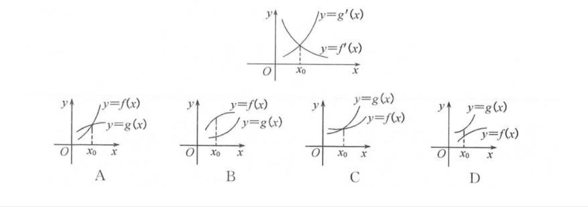
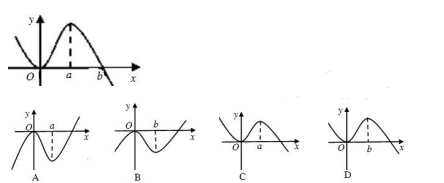
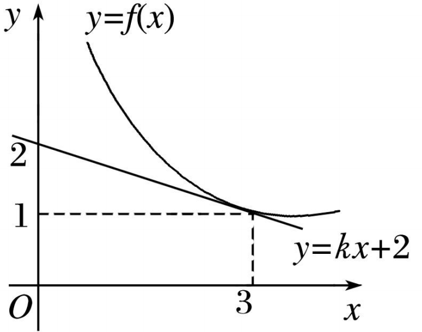

<h1 align="center">重点题整理（二）</h1>

#### 题目1

已知曲线$C:y=\frac 1 3 x^3+\frac 4 3$
(1)求曲线$C$上横坐标为$2$的点处的方程
(2)求(1)中的直线与曲线是否有其他公共点

##### 解：

(1)

$\because$函数图像的切线斜率必存在

设该直线的方程为$y=kx+b$

$y'=x^2$

$y'|_{x=2}=4$

$\therefore k=4$

$\because$直线过点$(2,4)$

$\therefore$直线的方程为$4x-y-4=0$

(2)

联立$\begin{cases}4x-y-4=0\\C\end{cases}\Longrightarrow x^3-12c+16=0\Longrightarrow (x-2)^2(x+4)=0$

解得$x=2$或$x=-4$

将$x=-4$带入$C$得

$y=20$

$\therefore$切线与$C$还有公共点$(-4,20)$

#### 题目2

已知函数$f(x)=ax^3+x+1$的图像在点$(1,f(1))$处的切线过点$(2,7)$，则$a=$

##### 解：

$f'(1)=3a+1$

$f(1)=a+2$

设该切线$l$为$y=kx+b$，则$k=3a+1$，且直线过点$(1,a+2)$

整理得，$l:y=(3a+1)x-2a+1$

$\because l$过点$(2,7)$

$\therefore a=1$

#### 题目3

设直线 $l_1,l_2$分别是函数$f(x)=\begin{cases}-\ln x,0<x<1 \\ \ln x,x>1\end{cases}$图像上点$P_1,P_2$处的切线，$l_1$与$l_2$垂直相交于点$P$，且$l_1,l_2$分别与$y$轴相交于点$A,B$,则$\triangle PAB$的面积的取值范围是

##### 解：

设$P_1(x_1,-\ln x_1),P_2(x_2,\ln x_2)$

$\because f'(x)=\begin{cases}-\frac{1}{x},0<x<1\\ \frac{1}{x},x>1\end{cases} $

$\therefore$设$l_{AP_1}:y+\ln x_1=-\frac{1}{x_1}(x-x_1)$，$l_{BP_1}:y-\ln x_2=\frac{1}{x_2}(x-x_2)$

令$x=0$，可求得$y_A=1-\ln x_1$，$y_B=-1+\ln x_2$

$\therefore |y_A-y_B|=2-\ln x_1x_2$

$\because k_1 \cdot k_2=-1$

$\therefore -\frac{1}{x_1x_2}=-1$

$\therefore |y_A-y_B|=2$

联立

$$\begin{cases} l_1\\l_2\end{cases} \Longrightarrow x_p=\frac{2-\ln x_1x_2}{\frac{1}{x_1}+\frac{1}{x_2}}=\frac{2}{x_1+x_2}$$

$\begin{aligned}\therefore S_{\triangle PAB}&=\frac{1}{2}|y_A-y_B|\cdot |x_P|  \\  &=\frac{1}{2}\cdot 2\cdot \frac{2}{x_1+x_2} \\ &=\frac{2}{x_1+x_2}\end{aligned}$

$\because x_1+x_2 \ge 2\sqrt{x_1x_2}=2$，当且仅当$x_1=x_2=1$时等号成立。

$\because x_1 \in (0,1)，x_2\in (1,+∞)$

$\therefore x_1+x_2 >2$ 

$\therefore \frac{2}{x_1+x_2} < 1$

$\therefore S_{\triangle PAB} \in (0,1)$

#### 题目4

已知曲线$y=x+\ln x$在点$(1,1)$处的切线与曲线$y=ax^2+(a+2)x+1$相切，则$a=$

##### 解：

$y|_{x=1}=1$

$y'|_{x=1}=2$

$\therefore$可以求得切线$l:y=2x-1$

记曲线为$C$，则$C':y'=2ax+a+2$

当$y'=2$时，$x=-\frac 1 2$

$\because l$与$C$相切

$\therefore C$过点$(-\frac 1 2,-\frac 5 2)$

带入解得

$a=10$

#### 题目5

如图所示为函数$y=f(x),y=g(x)$的导函数的图像，那么$y=f(x),y=g(x)$的图像可能是

##### 解：

在$(0,x_0),f(x)$的切线的斜率小于$g(x)$

在$x=x_0,f(x)$的切线的斜率等于$g(x)$

在$(x_0,+\infty),f(x)$的切线的斜率大于$g(x)$

故选择$D$项

#### 题目6

已知函数$y=xf'(x)$的图像如图所示，则函数$f(x)$的图像可能是

##### 解：

分析可得，在$(-\infty,0),f'(x)<0$

在$(0,b),f'(x)>0$

在$(b,+\infty),f'(x)<0$

$\therefore f(x)$在$(-\infty,0)$和$(b,+\infty)$单调递减，在$(0,b)$单调递增

$\therefore$选择$D$

#### 题目7

(1) 若函数$f(x)=\frac a x+x$在$(0,+\infty)$上单调递增，求$a$的取值范围

(2) 若函数$f(x)=ax^3+3x^2-x+1$在$\R$上是减函数，求$a$的取值范围

##### 解：

(1)

$f'(x)=-\frac{a}{x^2}+1$

$\because f(x)$在$(0,+\infty)$单调递增

$\therefore f'(x)\ge 0$在$(0,+\infty)$恒成立

$-\frac{a}{x^2}+1\ge 0\Longrightarrow a\le x^2\Longrightarrow a \le  (x^2)_{min}$

$\because (x^2)_{min}>0$

$\therefore a\in (-\infty,0]$

(2)

$f'(x)=3ax^2+6x-1$

$\because f(x)$单调递减

$\therefore f'(x)\le 0$

$\therefore \begin{cases}a<0\\\Delta\le0\end{cases}\Longrightarrow a\in(-\infty,-3]$

经检验，$a=-3$时满足题意

$\therefore a\in(-\infty,-3]$

#### 题目8

若函数$f(x)=\frac{2x}{x^2+1}$在区间$(m,4m-1)$单调递增，求实数$m$的取值范围

##### 解：

$f'(x)=\frac{-2x^2+2}{(x^2+1)^2}$

$\because f(x)$在$(m,4m-1)$单调递增

$\therefore f'(x) \ge 0 \Longrightarrow 2x^2\le 2\Longrightarrow x\in [-1,1]$

$\therefore \begin{cases}4m-1>m\\m\ge -1\\4m-1\le 1\end{cases}\Longrightarrow m\in(\frac 1 3,\frac 1 2]$

#### 题目9

若函数$f(x)=2x^2-\ln x$在其定义域内的一个子区间(k-1,k+1)内不是单调函数，则$k$的取值范围是

##### 解：

$f'(x)=4x-\frac 1 x$

当$f'(x)=0$

$4x^2=1\Longrightarrow x=±\frac 1 2$

$\therefore \begin{cases}k-1\le -\frac 1 2\\k+1>  -\frac 1 2\\k+1\le \frac 1 2\end{cases}or \begin{cases}k-1\ge -\frac 1 2\\k-1 < \frac 1 2\\k+1>\frac 1 2\end{cases}$

解得

$k\in [1,\frac 3 2)$

#### 题目10

已知函数$f(x)=\frac 1 3 x^3+ax^2-3a^2x+1,a\in \R$
(1)当$a=1$时，求曲线$y=f(x)$在点$(2,f(2))$处的切线方程
(2)若函数$f(x)$在区间(-2,3)上是减函数，求实数$a$的取值范围

##### 解

(1) 当$a=1$时

$f(x)=\frac 1 3 x^3+x^2-3x+1$

$f'(x)=x^2+2x-3$

$\therefore f(2)=-\frac 5 3,f'(2)=5$

$\therefore$切线的方程为$15x-3y-25=0$

(2)

$f'(x)=x^2+2ax-3a^2$

$\because f(x)$单调递减

$\therefore x^2+2ax-3a^2<0$

$(x+3a)(x-a)<0$

① $a>0$

$x\in (-3a,a)$

$\therefore \begin{cases}-3a\le-2\\a\ge 3 \\a>0\end{cases}\Longrightarrow a\in[3,+\infty)$

② $a<0$

$x\in (a,-3a)$

$\therefore \begin{cases}a\le -2\\-3a\ge 3 \\ a<0\end{cases}\Longrightarrow a\in (-\infty,-2]$

③ $a=0$

$x\in \varnothing$

综上所述 

$a\in (-\infty,-2]\cup[3,+\infty)$

#### 题目11

已知函数$f(x)=ax^3-3x^2+1-\frac{3}{a},(a\in \R且a\neq 0)$,求函数$f(x)$的极大值与极小值。

##### 解：

$f'(x)=3ax^2-6x=3x(ax-2)$

① $a>0$时，令$f'(x)=0$，$x=0$或$x=\frac{2}{a}$

当$x$变化时，$f'(x),f(x)$变化如下表

|$x$|$(-\infty,0)$|$0$|$(0,\frac{2}{a})$|$\frac{2}{a}$|$(\frac{2}{a},+\infty)$
|:-:|:-:|:-:|:-:|:-:|:-:
|$f'(x)$|$+$|$0$|$-$|$0$|$+$|
|$f(x)$|$↗$||$↘$||$↗$|

$f(x)_{极小值}=f(\frac{2}{a})=-\frac{4}{a^2}-1-\frac{3}{a}$

$f(x)_{极大值}=1-\frac{3}{a}$

② $a<0$时，令$f'(x)=0$，$x=0$或$x=\frac{2}{a}$

当$x$变化时，$f'(x),f(x)$变化如下表

|$x$|$(-\infty,\frac{2}{a})$|$\frac{2}{a}$|$(\frac{2}{a},0)$|$0$|$(0,+\infty)$
|:-:|:-:|:-:|:-:|:-:|:-:
|$f'(x)$|$+$|$0$|$-$|$0$|$+$|
|$f(x)$|$↗$||$↘$||$↗$|

$f(x)_{极小值}=1-\frac{3}{a}$

$f(x)_{极大值}=f(\frac{2}{a})=-\frac{4}{a^2}-1-\frac{3}{a}$

综上所述，当$x>0$时，

$f(x)_{极小值}=f(\frac{2}{a})=-\frac{4}{a^2}-1-\frac{3}{a}$

$f(x)_{极大值}=1-\frac{3}{a}$

当$x<0$时，

$f(x)_{极小值}=1-\frac{3}{a}$

$f(x)_{极大值}=f(\frac{2}{a})=-\frac{4}{a^2}-1-\frac{3}{a}$

#### 题目12

已知$f(x)=x^3+3ax^2+bx+a^2$在$x=-1$处有极值$0$，求常数$a,b$的值

##### 解：

由题意得

$\begin{cases}f(-1)=0\\f'(-1)=0\end{cases}\Longrightarrow \begin{cases}a=2\\b=9\end{cases} or \begin{cases}a=1\\b=3\end{cases}$

经检验，当$\begin{cases}a=1\\b=3\end{cases}$时，函数无极值

$\therefore \begin{cases}a=2\\b=9\end{cases}$

#### 题目13

设$a\in \R$，若函数$y=e^x+ax$有大于零的极值点，则实数$a$的取值范围是

##### 解：

$y'=e^x+a$

$\because$函数有大于零的极值点

$\therefore e^x+a=0$有大于零的解

$\because \forall x\in (0,+\infty),e^x\in (1,+\infty)$

$\therefore a\in (-\infty,-1)$

#### 题目14

若函数$f(x)=x^3-2cx^2+x$有极值点，则实数$c$的取值范围为

##### 解：

$f'(x)=3x^2-2cx+1$

$\because$函数有极值

$\therefore \Delta > 0$

$\therefore 16c^2-12>0$

解得$c\in(-\infty,-\frac{\sqrt 3}{2}\cup(\frac{\sqrt 3}{2},+\infty)$

#### 题目15

若函数$f(x)=\frac{x^3}{3}-\frac{a}{2}x^2+x+1$在区间$(\frac{1}{2},3)$上有极值点，求$a$的取值范围

##### 解：

$f'(x)=x^2-ax+1,x\in (\frac{1}{2},3)$

$a=x+\frac{1}{x},x\in (\frac{1}{2},3)$

$a\in [2,\frac{10}{3})$

#### 题目16

若函数$f(x)=\frac{ax^2}{2}-(1+2a)x+2\ln x(a>0)$在区间$(\frac 1 2,1)$内有极大值，则$a$的取值范围是

##### 解：

$f'(x)=ax-1-2a+\frac 2 x$

$\because f(x)$在区间$(\frac 1 2,1)$有极大值

$\therefore \begin{cases}f'(\frac 1 2)>0\\f(1)<0\end{cases}$

$\therefore a\in (1,2)$

#### 题目17

(1) 直线$y=kx+1$与曲线$y=x^3+ax+b$相切于点$A(1,3)$，则$2a+b=$
(2) 已知$f(x) = \ln x,g(x) = \frac{1}{2}x^2+mx+\frac{7}{2}(m<0)$,直线$l$与函数$f(x),g(x)$都相切,与$f(x)$的切点为$(1,f(1))$,求$m$.

##### 解:

(1)

$\because$直线过点$A$

$\therefore$直线的方程为$y=2x+1$

$\therefore y'_{曲线}|_{x=1}=2$

又$\because$曲线过点$A$

解得$\begin{cases}a=-2\\b=4\end{cases}$

$\therefore 2a+b=0$

(2)

解出$f(x)$的切线为$y=x-1$

$\because g(x) = \frac{1}{2}x^2+mx+\frac{7}{2}$

$\therefore$ 设切点为$(x_0, \frac{1}{2}x_0^2+mx_0+\frac{7}{2})$

$g'(x)=x+m$

联立方程:

$$\begin{cases} \frac{1}{2}x_0^2+mx_0+\frac{7}{2} = x_0 -1 \\ 1= x_0 + m \end{cases} $$

解得$m=-2$

#### 题目18

已知$y=f(x)$是可导函数，如图，直线$y=kx+2$是曲线$y=f(x)$在$x=3$处的切线，令$g(x)=xf(x)$,则$g'(3)=$

##### 解：

$g'(x)=f(x)+xf'(x)$

带入$x=3$得

$g'(3)=f(3)+3f'(3)$

由图像得$f(3)=1,f'(3)=-\frac 1 3$

$\therefore g'(3)=0$

#### 题目19

若存在过点$O(0,0)$的直线$l$与曲线$y=x^3-3x^2+2x$和$y=x^2+a$都相切，求$a$的值

##### 解：

记$y=x^3-3x^2+2x$为$C_1$，$y=x^2+a$为$C_2$

$C_1':y'=3x^2-6x+2$

设直线为$l:y=kx$

设直线$l$与$C_1$相交于$P(x_0,y_0)$

则$y_0=x_0^3-3x_0^2+2x_0,k=y'|_{x=x_0}=3x_0^2-6x_0+2$   

又$\because k =\frac {y_0}{x_0}=x_0^2-3x_0+2$

解得$x_0=\frac 3 2$或$x_0=0$

$\therefore k=-\frac 1 4$或$k=2$

$l:y=-\frac 1 4 x$或$y=2x$

$\begin{cases}l\\C_2\end{cases}\Longrightarrow a=1$或$a=\frac 1 {64}$

#### 题目20

已知曲线$y=\frac{1}{e^x+1}$，则曲线的切线斜率取得最小值时的直线方程为

##### 解

$y'=-\frac{e^x}{(e^x+1)^2}=-\frac{1}{e^x+2+\frac{1}{e^x}}\ge -\frac 1 4$

#### 题目21

若函数$f(x)=x^2-\ln x$上任意一点，则点$P$到直线$y=x-2$的距离的最小值为

##### 解

定义域$(0,+\infty)$

$f'(x)=2x-\frac 1 x$

当$f'(x)=1$时

$2x-\frac 1 x=1$

$\therefore x=1,P(1,1)$

计算得，该距离的最小值为$\sqrt 2$
